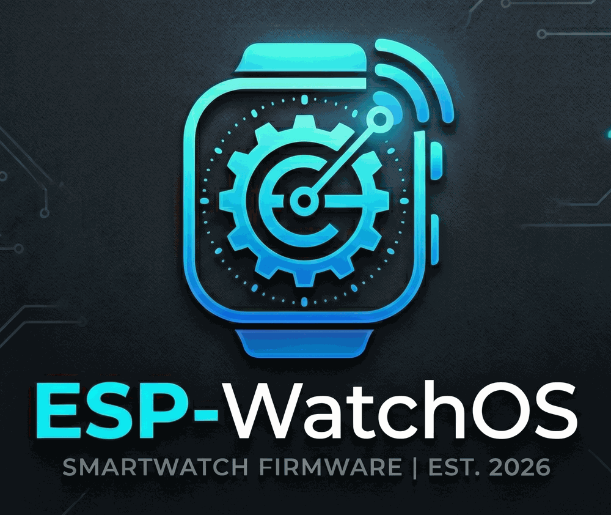

# ESPWatchOS

A custom smartwatch OS for the [Waveshare ESP32-C6-Touch-AMOLED-2.06](https://www.waveshare.com/wiki/ESP32-C6-Touch-AMOLED-2.06) (ESP32-C6, 2.06" 410x502 AMOLED touch display, QSPI, dual digital mics). Built on [ESP-Brookesia](https://github.com/espressif/esp-brookesia) for the phone-style launcher/app-lifecycle framework and [LVGL](https://lvgl.io/) for the UI.

## Layout

- `main/` - boot sequence, power/boot button handling, status bar clock/WiFi icon updates, AOD (always-on-display) handling.
- `components/system/` - shared OS services, each its own component: `alarm_shared`, `display_shared`, `homescreen_shared`, `os_fs` (LittleFS layout), `rtc_shared`, `timer_shared`, `webserver_shared` (WiFi settings UI, served from the watch itself), `wifi_shared` (WiFi scan/connect, reused by several apps below).
- `components/apps/` - independent apps, each a separate component launched from the home screen.
- `components/system/brookesia_core/` - vendored ESP-Brookesia framework source.
- `Schematic/` - board schematic (from Waveshare).

Both `components/apps` and `components/system` are wired in via `EXTRA_COMPONENT_DIRS` in the root `CMakeLists.txt` - any new component dropped in either directory is picked up automatically.

## Apps

| App | What it does |
| --- | --- |
| Watchface | Default home screen clock face |
| WiFi Connect | Scan and join a WiFi network |
| WiFi Analyzer | Live signal strength / channel view for nearby APs |
| Signal Tracker | Tracks a chosen AP's signal over time |
| Network Scanner | Finds devices on the local network via mDNS |
| Port Checker | Checks a host for open common ports |
| Timer | Countdown timer |
| Flappy | A Flappy Bird clone |
| Settings | Device settings |

## Adding a new app

Add a new component under `components/apps/`, subclass `esp_brookesia::systems::phone::App` (see any existing app for the `run`/`back`/`pause`/`resume`/`close` lifecycle), and register it with `ESP_UTILS_REGISTER_PLUGIN_WITH_CONSTRUCTOR` - apps self-register at startup, so nothing else needs editing to wire it into the launcher.

## Known limitations

- WiFi credentials are stored unencrypted on the LittleFS filesystem (`wifi_shared`) - readable with physical/USB access to the device.
- The settings webserver (`webserver_shared`) has no authentication - anyone on the same WiFi network can reach it.

## Building

Requires ESP-IDF (`CONFIG_IDF_TARGET=esp32c6`, see `sdkconfig.defaults`). Standard ESP-IDF workflow:

```sh
idf.py build
idf.py -p <PORT> flash monitor
```

## License

Apache 2.0, see `LICENSE`. Built on Espressif's ESP-Brookesia and LVGL, and Waveshare's board support package.
